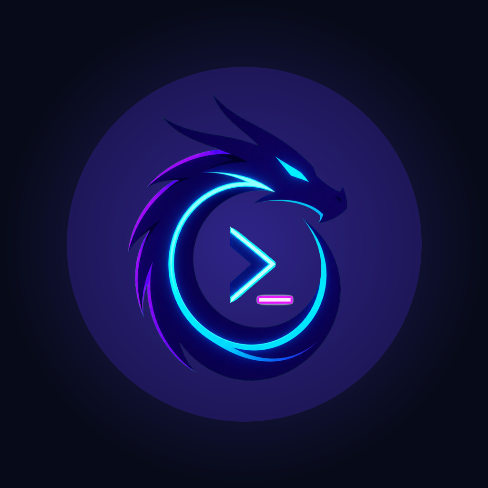
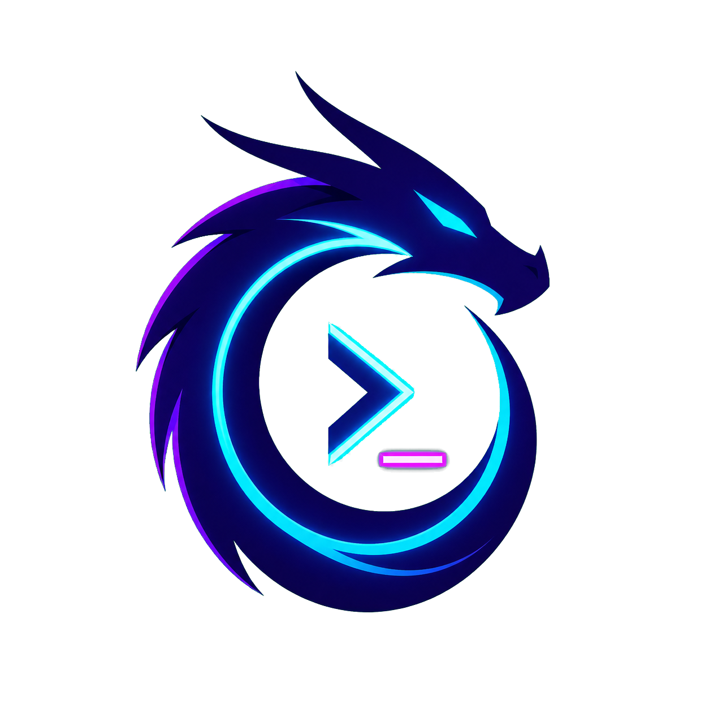

  

<h1 align="center">Drakoryia</h1>

  <strong>The local command center for AI coding agents.</strong> 
  One canvas. Many CLIs. Complete control.

  <a href="#the-idea">The idea</a> ·
  <a href="#built-around-your-work">Workspaces</a> ·
  <a href="#local-by-design">Local by design</a> ·
  <a href="#the-direction">The direction</a>

> **Status:** Product definition is underway. This README describes the direction we are building toward in the open; it is not a claim that every capability is available today.

## The idea

AI coding agents made terminals more capable. They also made the developer the bottleneck: windows disappear behind one another, contexts blur, finished work goes unnoticed, and coordinating parallel work becomes work of its own.

Drakoryia is a local-first desktop application for orchestrating CLI-based AI agents visually. It brings Codex, Claude Code, OpenCode, Pi DEV, and future tools into a workspace-aware canvas where work remains visible, organized, and recoverable.

It is not another hosted chat interface. It is the **CLI of CLIs**: a command center that gives developers the leverage to work with one agent for a focused task or several agents for a complex one—without losing the thread.

## Built around your work

### A workspace is a real place

Every Drakoryia workspace is connected to a local directory chosen or created by its owner. Workspaces can be opened side by side, switched instantly through tabs, edited as projects evolve, or archived when context should be preserved without remaining active.

Deleting a workspace removes only Drakoryia's own workspace data: its canvas, saved session metadata, workspace settings, and local Drakoryia-managed Skills and MCPs. **Drakoryia never deletes the user's directory or its contents.**

### A canvas for parallel thinking

Terminals, notes, groups, diagrams, and other visual building blocks belong in the same spatial environment. Give each piece of work a position, see what is happening at a glance, and keep project knowledge next to the agents doing the work.

The canvas will grow deliberately: the most valuable nodes and interactions come first, with room for a richer visual toolset over time.

### The agents are still your CLIs

An agent in Drakoryia is a local CLI session enhanced with the Drakoryia MCP. The application does not replace the tools developers already trust—it makes them easier to launch, configure, observe, coordinate, and resume.

Global defaults flow into workspace settings, and workspace settings can be refined for an individual agent session. Model, effort, fast mode, relevant Skills, and relevant MCPs follow the context in which the agent is working.

## Orchestrate without losing control

### Sessions that come back

A workspace should remember where work stopped. Drakoryia is designed to save canvas state and the metadata needed to resume supported CLI sessions after the application closes, the machine restarts, or local data is restored elsewhere.

It treats continuity honestly: an operating-system process cannot remain alive through a shutdown. Running agents are closed safely, their resumption data is retained, and the next workspace session can continue from the saved context.

### Skills and MCPs, where they belong

Skills and MCP integrations can be global or workspace-specific. They live as local artifacts managed by Drakoryia rather than inside a project's version-controlled source tree.

The goal is a collaborative creation flow: ask an agent to help create a Skill or MCP, review its work in real time, then apply it to the intended scope. The right capabilities should reach the right agents without turning every project into a configuration maze.

### Usage at a glance

Drakoryia will surface the official usage and quota information exposed by supported CLIs, so developers can understand available capacity and recent consumption without breaking focus to hunt through separate tools.

### Built for safety

Important actions are intentional. Workspace, session, and configuration changes are confirmed before they are applied. Closing active agent sessions makes the consequence clear. Drakoryia never takes ownership of the user's project directory, and never deletes it.

## Local by design

Your projects, canvas, sessions, configuration, Skills, and MCP artifacts belong on your machine.

- **No required account.** The product is designed to start from the developer's local environment.
- **No Drakoryia cloud dependency.** The application should remain useful without a hosted control plane.
- **Backup is ownership.** Local data, including the LevelDB store and managed artifacts, can be copied and restored by the user.
- **Providers remain explicit.** Each CLI continues to use its own authentication, network access, and provider policies. Drakoryia orchestrates the local experience; it does not disguise those boundaries.

## The direction

Drakoryia is being shaped as a robust developer environment around CLI agents—not merely as an infinite canvas. The long-term platform will keep adding the practical tools that make multi-agent work clearer, safer, and more useful across projects:

- cross-platform desktop support for macOS, Windows, and Linux;
- a visual canvas that evolves with real developer workflows;
- multi-workspace control without context switching overhead;
- a first-class Drakoryia MCP for structured agent collaboration;
- reusable, reviewable Skills and MCPs at global and workspace scope;
- durable session recovery and portable local backups; and
- actionable, provider-sourced usage visibility.

The principle is simple: **more capability should not mean more chaos.** Drakoryia exists to make the growing power of coding agents feel deliberate, visible, and entirely yours.

---

   
  Created by Sami Henrique · Built locally. Orchestrated visually. Owned by the developer.

